# 🏁 Laboratorio: Construcción de Objetos en JavaScript

Este laboratorio nos permitió practicar la creación de objetos usando **funciones constructoras**, el uso de **this** para referirnos a las propiedades internas del objeto, y el operador **new** para crear instancias a partir de dichos constructores. También trabajamos con la interacción desde la terminal usando **process.argv** para recibir datos del usuario al ejecutar el programa.

## 🧩 Explicación de cada tarea

### ✅ Task 1 — Constructor básico
Se utilizó una función constructora `Mail` para crear un objeto con las propiedades `subject` y `message`.  
La instancia del objeto se creó usando `new Mail("hello", "world")`.

**Código:**
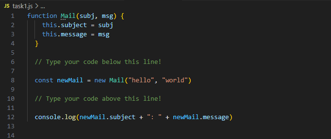

**Resultado:**
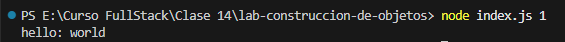

### ✅ Task 2 — Constructor con datos dinámicos
Se usó nuevamente el constructor `Mail`, pero esta vez el asunto y el mensaje vinieron desde la terminal usando `process.argv[3]` y `process.argv[4]`.  
Esto permitió que el usuario estableciera los valores al ejecutar el programa.

**Código:**
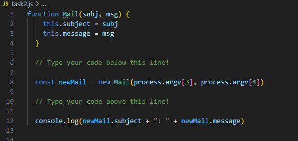

**Resultado:**
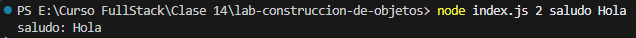

### ✅ Task 3 — Método dentro del constructor
Se agregó un método `printMail()` al constructor `Mail`, el cual muestra en consola el mensaje en el formato:
Esto reforzó cómo agregar **comportamiento** a los objetos, no solo datos.

**Código:**
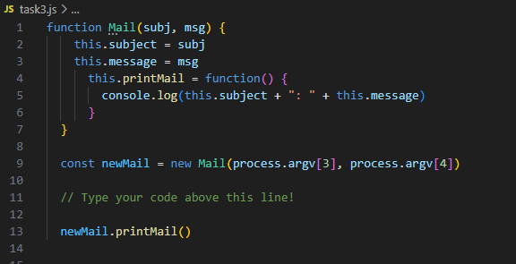

**Resultado:**
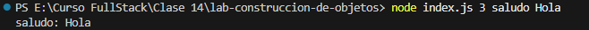

### ✅ Task 4 — Constructor personalizado (`Journey`)
Se creó un constructor `Journey(start, end)` y luego se recibió el punto de origen y destino desde la terminal.  
La salida final imprime:

**Código:**


**Resultado:**
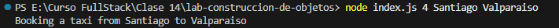

### ✅ Task 5 — Lista de amigos
Se creó `FriendsList`, que inicializa un **array vacío** usando `this.friends = []`.  
Luego, el usuario ingresa cuántos nombres quiere agregar y se usa un **bucle for** para agregarlos con `.push()`.  
Finalmente, se imprime la lista completa.

**Código:**
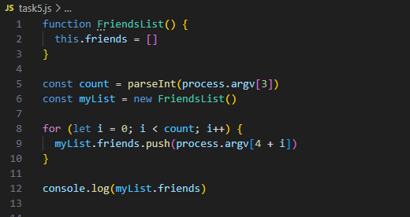

**Resultado:**
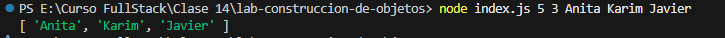

### ✅ Task 6 — Lista de compras (artículos + cantidades)
Se creó `ShoppingList`, que almacena productos y cantidades en un **objeto** interno:
Si un producto se repite, su cantidad se **suma**, evitando duplicados y permitiendo manejar datos de forma más estructurada.

**Código:**
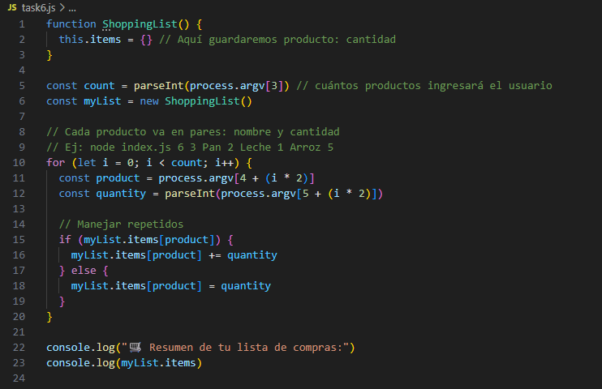

**Resultado:**
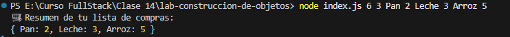

### ✅ Task 7 — Objeto “Car”
Se creó el constructor `Car(marca, modelo, year, motor, color, km)` y se agregó un método `.describe()` para mostrar en consola las características del auto.
Esto mostró cómo asignar propiedades y métodos dentro de un objeto.

**Código:**
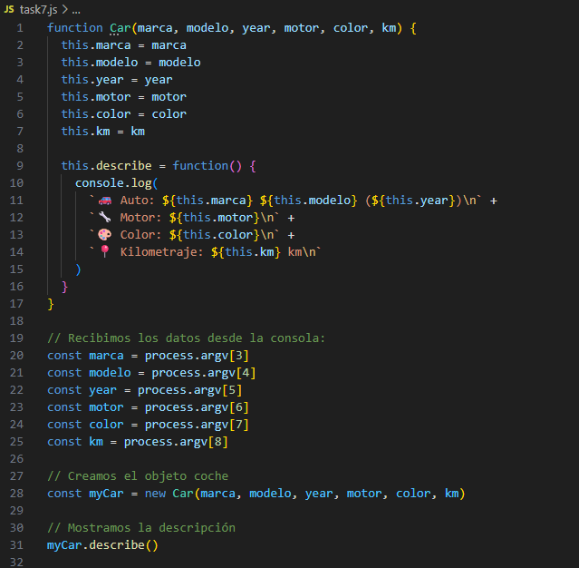

**Resultado:**


## 🧠 Reflexión final

### 1. ¿Diferencia entre objetos literales y funciones constructoras?
#### ✅ Objeto Literal
Un **objeto literal** es un objeto creado de forma directa usando llaves `{ }`. Se utiliza cuando necesitamos **solo una instancia** y no planeamos crear más objetos con la misma estructura.
```js
let estudiante = {
  nombre: "Nicolás",
  edad: 27
} 
```

#### ✅ Función Constructora

Una **función constructora** funciona como un **molde** para crear muchos objetos con la misma estructura, pero con valores diferentes. Su nombre comienza con **mayúscula**, utiliza **`this`** para asignar propiedades y se usa junto con el operador **`new`** para crear cada objeto.
```js
function Estudiante(nombre, edad) {
  this.nombre = nombre
  this.edad = edad
}

let estudiante1 = new Estudiante("Nicolás", 21)
let estudiante2 = new Estudiante("Catalina", 22)
```

### 2. ¿Cómo ayuda `this` dentro de un constructor?
`this` se refiere al **objeto que se está creando**, evitando que los valores se mezclen entre instancias.


### 3. ¿Similitudes con clases en otros lenguajes?
Las funciones constructoras cumplen el mismo propósito que las clases en lenguajes como Java, C# o Python, permitiendo encapsular datos y comportamiento.

